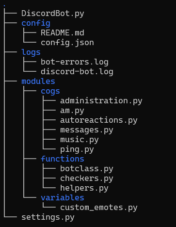

<div>
  <h1 align="center">Discord bot</h1>
  <b>My discord bot made in python.</b>
  <a target="_blank" href="https://github.com/r4v10l1/discord-bot">
    
  </a>
  <br><br>
</div>

[![Forks][forks-shield]][forks-url]
[![Stargazers][stars-shield]][stars-url]

## Table of contents
* [Features](#features)
	* [Music](#music)
	* [Music](#messages)
	* [Administration](#music)
	* [Misc](#music)
* [Running the bot yourself](#running-the-bot-yourself)
* [Structure of the bot](#structure-of-the-bot)
* [Possible errors](#possible-errors)
* [Todo](#todo)
* [Related gists](#related-gists)

## Features

### Music:
* `n!help` - Shows a help similar to this readme.
* `n!play <url>` - Play audio in a voice channel (.mp3 url, youtube url or youtube search).
* `n!join` - Join the user's channel.
* `n!join_channel <channel_name>` - Join the specified channel.
* `n!leave` - Leaves the current channel.
* `n!pause` - Pauses the audio.
* `n!resume` - Resumes the audio.
* `n!stop` - Stops the audio without leaving the channel.

### Messages
* `n!ping` - The bot reacts to your message to make sure it is online.
* `n!memes` - Le funny.
* `n!version` - Compares the current version (Whale emoji) with the remote version (Check or cross emoji depending if they match). Also `n!ver`.

### Administration:
This commands will only work if you are the bot owner or if you are in the whitelist.
* `n!kick @someone` to kick a user.
* `n!ban @someone` to ban a user.
* `n!move @someone <channel>` to move a user.
* `n!mute @someone` to mute a user. Also `n!m`.
* `n!unmute @someone` to unmute a user. Also `n!um`.
* `n!deafen @someone` to deafen a user. Also `n!d`.
* `n!undeafen @someone` to undeafen a user. Also `n!ud`.
* `n!purge @someone <messages_to_check>` will check X messages, and will delete them if the author is the specified user. Also `n!clean`.
* `n!spam <amount> <message>` will spam the specified messae in the current channel the amount of times.

This commands will only work if you are the bot owner or you are in the am whitelist:
* `n!am` if you want to know about this one, check the code yourself :)

### Misc:
* `ping` or `n!ping` to make sure it works.
* Detects if a message contains `uwu`, then screams.
* Leaves the channel if alone for 30 seconnds.
* Has a `n!play` blacklist in case someone listens to k-pop.
* Has a whitelist for administration commands (Checks the whitelist instead of the role).
* Send custom embeds to a custom channel with `console.py`.
* Can autoreact to user's messages. See [this link](https://carpedm20.github.io/emoji/all.html?enableList=enable_list_alias) for emote names.
	* Tries to find regional discord emojis in the `custom_emojis` dictionary. If it doesn't find it tries to use the emoji module with 2 different languages.
* Logs with a new system:
	* `[W]` for warnings.
	* `[E]` for errors (`discord_log_path`)
	* `[ET]` for error timestamps (Wrote to `discord_log_path`, reference a date in `bot_error_path`)
	* `[Module]` It also has a small tag about the module used (`Music`, `Administration`, ...)
* Fetches the last remote repo information and compares the last origin/main commit with the head commit. See `n!version`

## Running the bot yourself
First, you will need to edit the `.env_default` file (move it to `.env`), and replace there your bot token.
```bash
# .env
DISCORD_TOKEN={YOUR_TOKEN_HERE}
```
You will also need to edit the configuration file (`settings.py`) and the whitelists file (`config/config.json.default` which you will need to move to `config.json`).
```bash
vim settings.py
vim config/config.json
```
You can then run the bot with docker:
```bash
docker build -t discord-bot .
docker run --rm -d -it --name discord-bot discord-bot
```
Or run it normally:
```bash
# You will need to install some depencencies
python3 -m pip install -r requirements.txt

# Make it executable and start it. This script will then create a screen session
chmod +x start-bot.sh
./start-bot.sh
```
After running the bot, a screen session named `DiscordBot`.
```bash
screen -ls            # To list the sessions
screen -r DiscordBot  # Resume
# Ctrl+D + Ctrl+A to detach the session again
```

## Structure of the bot
The bot uses [`cogs`](https://discordpy.readthedocs.io/en/stable/ext/commands/cogs.html) to organize the functions (commands) into different files.  
The structure of the bot is the following:  



* `DiscordBot.py` is the main file. It will create the bot and manage all the cogs.
* In the `config` folder you can edit the `config.json` file. This file contains all the whitelists and blacklists for the bot.  
	You can check its [`readme.md`](https://github.com/r4v10l1/discord-bot/tree/main/config).
* The `logs` folder is the folder that the commands will write when events happen.
* The `modules` folder contains all the python files needed for the bot to work.
	* In the `cogs` folder you can find a file for each cog, divided by categories. These are the commands itself.
	* In the `functions` folder you can find files for functions or classes that the bot needs, for example `debug_print()` or `error_print()`, that show the events that the bot recieves.  
		The file `botclass.py` contains the class of the bot itself.
	* In the `variables` folder you can find files that contain variables or data that the bot needs. For example `custom_emotes.py` contains all the regional emotes in unicode format needed for reactions.

Thanks to the [discord.py](https://discord.com/invite/r3sSKJJ) community for being so kind and helping me out. :)


## Possible errors
* The bot can't download age-restricted content.
* The bot might fail depending on the youtube servers.
* The bot can't play playlists right now.

## Todo
- [X] Bot needs to be on a channel to play music, if you use `n!play <song>` the bot will join, but you will need to type the command again for it to work. You can use `n!join` to make the bot join the channel before using `n!play`.
- [X] Add a `n!help` command.
- [X] Make the bot "stream" the songs instead of downloading them.
- [X] Add autorreactions for users and guilds.
    - [ ] Add autorreact command for appending to the json?
- [X] Move whitelists to json file and read it from there instead of the code (so users can edit it easily).
- [X] Separate code into multiple files.
- [X] Add tags to `debug_print()`
- [X] Add `n!version` for checking the commit hash with [git](https://stackoverflow.com/a/41210204/).
- [ ] Wanna play blackjack with the bot  **:^)**
- [ ] Add queue system.
- [ ] Change messages (joined, playing...) to embeds.
- [ ] Add `n!stats` command.
    - [ ] Show uptime? -> From inside docker
- [ ] Add `n!poll` and `n!roles` (that reads from `config.json`) command for starting polls or giving roles based on message reactions.

## Related gists
* [discord_purge.py](https://gist.github.com/r4v10l1/a21360c3f92266c0b03db7cc9b73e7ff) - Discord bot purge 1.
* [discord_purge2.py](https://gist.github.com/r4v10l1/c684325e461d70c06b76277aedfe08d8) - Discord bot purge 2.
* [discord_purge3.py](https://gist.github.com/r4v10l1/c6af5d4149c0d6c04d4b8f94887a2ae3) - Discord bot purge 3.
* [check_inactive.py](https://gist.github.com/r4v10l1/0793c5e2d37bf77d5f279643f03d6112) - Check if the bot is alone in a channel for X secconds.

[forks-shield]: https://img.shields.io/github/forks/r4v10l1/discord-bot.svg?style=for-the-badge
[forks-url]: https://github.com/r4v10l1/discord-bot/network/members
[stars-shield]: https://img.shields.io/github/stars/r4v10l1/discord-bot.svg?style=for-the-badge
[stars-url]: https://github.com/r4v10l1/discord-bot/stargazers
